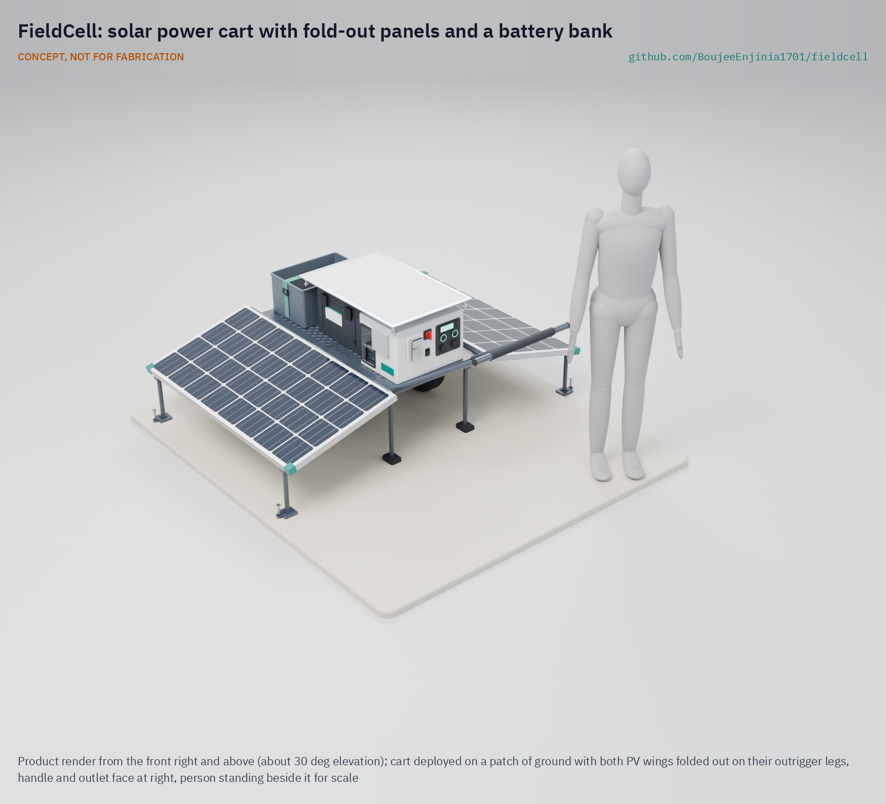

# FieldCell

     

**Area:** Situational Field Hardware · **TRL:** 3 of 9 (proof of concept on paper) · **Prototype budget:** about $2,100 USD · **Difficulty:** 3 of 5

Two-wheel hand cart carrying fold-out PV and a LiFePO4 bank, with an inverter and DC outlets, that one person can deploy in under 10 minutes.

[Exploded render](media/render-exploded.png) · [Detail render](media/render-detail.png) · [Interactive 3D model](media/viewer.html) · [Concept blueprint (PDF)](media/concept-blueprint.pdf) · [General arrangement FCL-DWG-002 (PDF)](cad/drawings/FCL-DWG-002.pdf) · [Sizing calculations](docs/04-calcs/01-sizing.md) · [Review note](docs/REVIEW.md)

## Concept rationale

Most field posts need a few hundred watts, not the several kilowatts of a generator, and they need it quietly, next to people, from the first hour. FieldCell puts about 1.3 kWh of LiFePO4 storage and 400 W of solar on a two-wheel cart whose sides are the panels themselves, so there is nothing to lay out, aim or cable on arrival: one person wheels it in, folds the wings down and switches on. The fixed east-west wings give up some energy against a sun-aimed panel in return for speed and a closed, protected box in travel.

It is open and garage-buildable because the organizations that deploy it, from volunteer fire brigades to small humanitarian teams, need to inspect, repair and adapt it where they work. A welded steel frame, off-the-shelf charge controller, inverter and outlets, and a priced, documented BOM mean it can be built and serviced with common tools and without custom electronics.

## Burning platform

Generators are the default for temporary power, and they kill. In the United States, portable generators were linked to 800 of 931 non-fire carbon monoxide deaths associated with engine-driven tools from 1999 to 2012, more than 85 % ([US Consumer Product Safety Commission, 2013](https://cpsc.gov/content/winter-warning-portable-generators-hold-top-spot-in-cpsc-report-on-carbon-monoxide-deaths)). The outages that send people to generators are getting longer: US electricity customers averaged 11 hours without power in 2024, nearly double the average of the previous decade, and major events such as Hurricanes Beryl, Helene and Milton accounted for 80 % of those hours ([US Energy Information Administration, 2025](https://www.eia.gov/todayinenergy/detail.php?id=66744)).

Where there is no grid at all, field teams start from nothing. In 2023, 666 million people still lacked electricity, 85 % of them in sub-Saharan Africa ([World Bank, *Tracking SDG 7*, 2025](https://www.worldbank.org/en/topic/energy/publication/tracking-sdg-7-the-energy-progress-report-2025)), so relief and survey crews there bring their own power or do without.

## Where it could be used

### By industry

| Industry | Use |
| --- | --- |
| Disaster response and emergency management | Quiet power for radios, lighting, laptops and chargers at incident command posts, shelters and search and rescue bases |
| Humanitarian aid | Registration desks, water points and clinics in camps where fuel is scarce and resupply is slow |
| Utilities and infrastructure | Daytime tool and battery charging for line, pipeline and telecom crews away from vehicle tracks |
| Environmental survey and conservation | Power for instruments, drones and camp electronics in protected areas where generators are unwelcome |
| Events and community resilience hubs | Shared phone charging, lighting and Wi-Fi in parks and schools during outages |
| Education | A teaching platform for PV, batteries, inverters and electrical safety |

### By country or region

| Country or region | Why it matters there |
| --- | --- |
| United States (Southeast and Gulf Coast) | South Carolina customers averaged nearly 53 hours without power in 2024, mainly from Hurricane Helene ([US EIA, 2025](https://www.eia.gov/todayinenergy/detail.php?id=66744)) |
| Philippines | An average of 20 tropical cyclones enter its area of responsibility each year, 8 or 9 of them crossing the country ([PAGASA](https://www.pagasa.dost.gov.ph/climate/tropical-cyclone-information)) |
| Pakistan | The 2022 monsoon floods affected an estimated 33 million people ([UN News, 2022](https://news.un.org/en/story/2022/08/1125752)) |
| Sub-Saharan Africa | Home to 85 % of the 666 million people without electricity in 2023 ([World Bank, 2025](https://www.worldbank.org/en/topic/energy/publication/tracking-sdg-7-the-energy-progress-report-2025)) |
| Caribbean (Puerto Rico and US Virgin Islands) | After Hurricanes Irma and Maria in 2017, restoring power to all customers whose structures were safe to reconnect took about 11 months in Puerto Rico and about 5 months in the US Virgin Islands ([US GAO, 2019](https://www.gao.gov/products/gao-19-296)) |

## What sparked the idea

The idea traces back to the US Marine Corps Experimental Forward Operating Base program, which equipped India Company, 3rd Battalion, 5th Marines in Sangin District, Afghanistan, with portable solar systems such as GREENS and SPACES. At Patrol Base Sparks, the unit reported that generators that typically burned more than 20 gallons (76 L) of fuel a day were down to 2.5 gallons (9.5 L), which meant fewer refuelling convoys exposed to roadside bombs ([DVIDS, January 6, 2011](https://www.dvidshub.net/news/63126/india-company-3-5-dark-horse-marines-use-solar-power-brighten-mission-accomplishment)). The same logic holds for a disaster zone, where every fuel run competes with rescue traffic. Those were military kits issued to trained units. FieldCell asks what an open, one-person version for civilian responders would look like: panels, battery and outlets on one cart, working minutes after arrival.

## Problem

Disaster responders and remote crews rely on noisy, fuel-hungry generators.

## Concept

Two-wheel hand cart carrying fold-out PV and a LiFePO4 bank, with an inverter and DC outlets, that one person can deploy in under 10 minutes.

Full design precis: [docs/02-concept.md](docs/02-concept.md)

## Key components

- Folding PV panels 200 W (2)
- LiFePO4 bank 1.28 kWh (25.6 V 50 Ah)
- MPPT charge controller
- Inverter 1 kW
- Welded steel cart frame, 16 in flat-free wheels
- IP65 battery case and IP54 electronics enclosure with thermostat filter fan
- Reflective sun shade over both enclosures, hinge line on a 20 mm spacer

The priced bill of materials is in [bom/bom.csv](bom/bom.csv) (about $2,051 at TRL 3, within the $2,100 budget decided on 2026-09-25; see the review note).

## Safety

> Contains a high-energy battery and AC output. Fuse every circuit and follow local electrical code.

## Repository layout

| Folder | Contents |
| --- | --- |
| `docs/` | Problem, concept, requirements, calculations and design decisions |
| `cad/src/` | build123d Python source, the source of truth for all geometry |
| `cad/step/`, `cad/stl/` | Exported models for FreeCAD, other CAD tools and printing |
| `cad/drawings/` | 2D sketches and dimensioned drawings |
| `bom/` | Bill of materials |
| `electronics/` | KiCad schematics and PCB layouts |
| `firmware/` | Microcontroller code |
| `media/` | Renders, perspectives and photos |
| `build-log/` | Dated prototyping notes |

## Documentation

Controlled documents follow the portfolio [documentation standard](.kit/STANDARDS.md). Each carries a document ID (FCL-PRC-001 for the precis), a version and a revision history. Branded PDFs are built with `python .kit/render.py` and attached to GitHub Releases when a document is tagged, for example `FCL-PRC-001/v1.0`.

## Credits

Designed by Amish Chadha. See [CONTRIBUTORS.md](CONTRIBUTORS.md) for roles. To cite this design, use [CITATION.cff](CITATION.cff) (GitHub shows it as "Cite this repository").

AI assistance (Claude) was used to accelerate concept renders, prototype documentation and first-pass sizing calculations. Design direction and all decisions are Amish Chadha's, recorded in this repository's decision records (`docs/decisions/`).

## Licenses

- **Hardware** (CAD, drawings, BOM, electronics): [CERN-OHL-S v2](LICENSE)
- **Software** (firmware, scripts, notebooks): [MIT](LICENSE-SOFTWARE)

A project of the [Design Molecule](https://designmolecule.com) lab.
