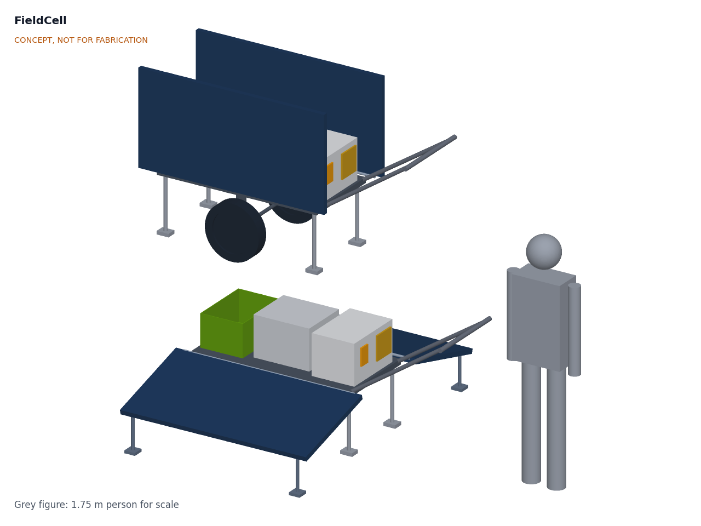
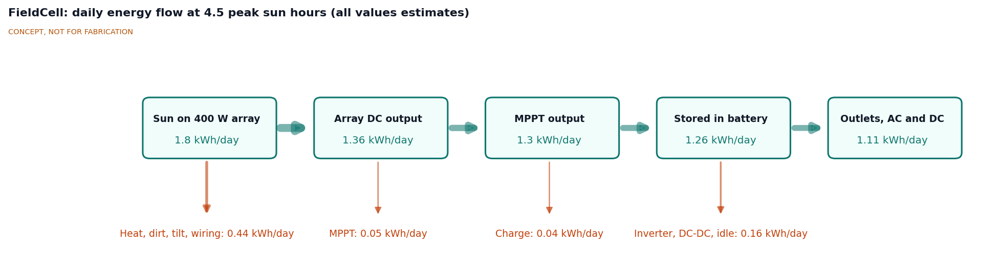
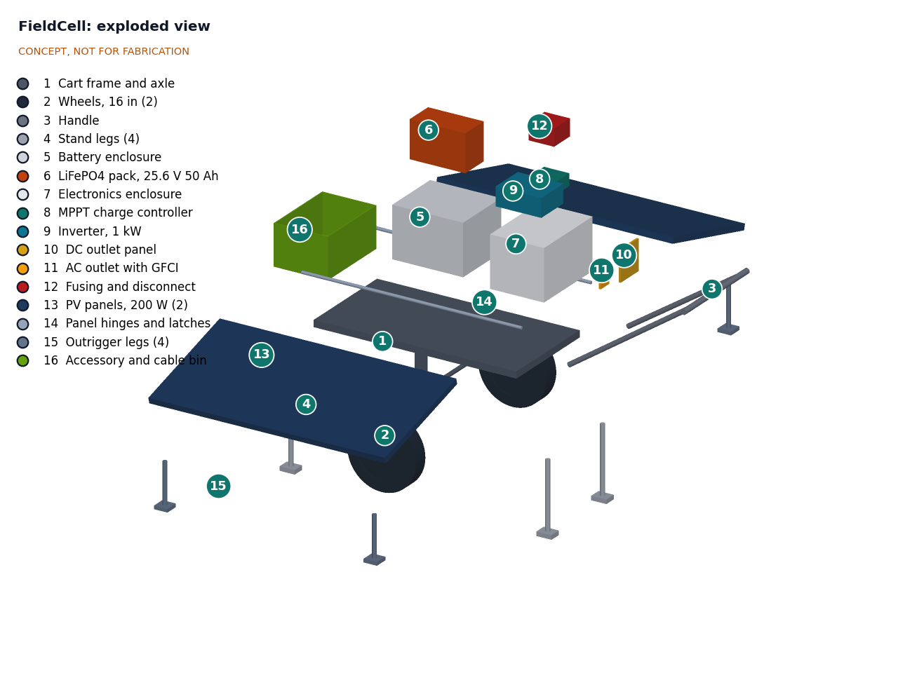

# FieldCell design precis

FieldCell is a two-wheel hand cart whose two sides are 200 W solar panels. For travel the panels stand up as the cart walls; on site they fold out as wings on outrigger legs. Between them sit a 1.28 kWh LiFePO4 pack, an MPPT charger, a 1 kW inverter and DC outlets. First-order numbers suggest it stores about 1.1 to 1.4 kWh a day from its own PV at 4 to 5 peak sun hours, carries a 0.9 kWh/day field load through one day without sun, weighs about 68 kg, and deploys in about 6 minutes, for about $1,460 in parts.

*Figure 1. FieldCell deployed (front) and stowed for travel (behind), with a 1.75 m person for scale. Massing model.*

## How it works

1. **Travel.** The wings are latched upright as the cart sides, over the battery and electronics. One person pulls or pushes the cart by the T-handle on two 16 in (406 mm) wheels. The center of gravity sits about 60 mm on the handle side of the axle, so the handle carries a light, positive load.
2. **Park.** Four stand legs fold down so the deck sits level at about 460 mm.
3. **Deploy.** Each wing unlatches and swings out on a continuous hinge along the side rail, coming to rest 15 degrees below horizontal on two fold-down outrigger legs. With the cart's long axis north to south, one wing faces east and one faces west. In wind, the four outrigger feet are staked.
4. **Charge.** The panels are pre-wired in parallel to the MPPT charge controller, which charges the 25.6 V pack. No cable is connected on site.
5. **Power.** The operator switches on the battery isolator and the inverter. Loads plug into the AC outlet (GFCI protected) and the DC panel (USB-C PD and 12 V sockets) on the handle end of the electronics box. A shunt monitor shows state of charge.

*Figure 2. Daily energy flow at 4.5 peak sun hours. All values are estimates.*

## Main components

Numbers match the exploded view (Figure 3) and `bom/bom.csv`.

*Table 1. Main components.*

| # | Component | Proposed choice | Notes |
| --- | --- | --- | --- |
| 1 | Cart frame and axle | 40 x 40 mm steel square tube, 1,200 x 600 mm, mesh deck, 20 mm axle | Welded; steel versus aluminium proposed, awaiting Amish |
| 2 | Wheels (2) | 16 in (406 mm) flat-free or pneumatic, 720 mm track | Flat-free recommended for debris, awaiting Amish |
| 3 | Handle | Steel T-handle, grip at about 900 mm | Detaches for vehicle transport |
| 4 | Stand legs (4) | Folding tube legs with feet | Level the deck when parked |
| 5 | Battery enclosure | IP65 case, about 420 x 360 x 300 mm | Sits over the axle, lowest heavy item |
| 6 | LiFePO4 pack | 25.6 V 50 Ah (1.28 kWh), 100 A BMS with low-temperature charge cutoff | 24 V system proposed, awaiting Amish |
| 7 | Electronics enclosure | IP54 with filtered, baffled vent, about 320 x 460 x 300 mm | Outlet face toward the handle |
| 8 | MPPT charge controller | 100 V, 20 A | About 15 A peak from 400 W |
| 9 | Inverter | 1 kW continuous, 2 kW surge, pure sine, 24 V input | 120 V first, 230 V variant; awaiting Amish |
| 10 | DC outlet panel | 2 x USB-C PD 100 W, 2 x 12 V sockets, 24 to 12 V 20 A converter | About 440 W DC in total |
| 11 | AC outlet with GFCI | GFCI duplex (120 V) or 30 mA RCD socket (230 V), in-use cover | |
| 12 | Fusing and disconnect | Class T 100 A main fuse at the battery, isolator, DC breakers, shunt monitor | |
| 13 | PV panels (2) | 200 W lightweight, about 1,400 x 700 x 35 mm, 24 V class (Vmp about 36 V) | Parallel wiring proposed, awaiting Amish |
| 14 | Panel hinges and latches | Continuous hinge per side, over-center latches | Pinch points; see Safety |
| 15 | Outrigger legs (4) | Folding legs with stake loops, set the 15 degree tilt | Stakes required above about 9 m/s wind |
| 16 | Accessory and cable bin | Open bin, balances the electronics box | Cords, lights, stakes |
| 17 | Wiring and hardware | 16 mm² (6 AWG) battery cable, PV cable, glands, fasteners | Not modeled |

## First-order numbers

All values are estimates for concept review and will be checked at TRL 3. They are computed in `cad/src/concept_media.py`.

*Table 2. First-order numbers.*

| Quantity | Estimate | Basis | Requirement |
| --- | --- | --- | --- |
| Stored energy | 1.28 kWh nominal, about 1.15 kWh usable | 25.6 V x 50 Ah; 90 % depth of discharge | R1 met |
| PV energy into battery | 1.12 to 1.40 kWh/day | 400 W x 4 to 5 peak sun hours x 0.754 array derating x 0.96 MPPT x 0.97 charge | R3 met, thin at 4 h |
| Peak charge power | about 300 W | 400 W x about 0.8 at noon, east-west wings | |
| Full recharge, 10 to 100 %, no load | about 0.8 day at 5 h, 0.9 day at 4.5 h | 1.15 kWh / daily yield | R3 met |
| Reference load from battery | about 1.03 kWh/day | 0.9 kWh/day at the outlets, conversion losses below | |
| Autonomy with no sun | about 1.1 days | 1.15 kWh / 1.03 kWh/day | R4 met, thin |
| Battery current at 1 kW AC | about 46 A (93 A surge) | 1,000 W / 0.90 / 24 V | Sets 100 A BMS and fuse |
| Total mass | about 68.5 kg | Table 5 | R6 met, thin |
| Center of gravity | about 63 mm toward the handle from the axle, 575 mm above ground | Table 5 | R6 |
| Handle force, travel | about 34 N level; 17 to 52 N at 5 degree pitch | CG offset x weight / 1,240 mm axle-to-grip | R6 met |
| Lateral static tip angle | about 32 degrees | atan(360 mm half-track / 575 mm CG height) | R7 met |
| Pull force, 10 % grade | about 110 N (gravel) to 135 N (grass) | 672 N weight x (0.10 grade + 0.06 to 0.10 rolling) | R7 met, thin |
| Ground clearance | about 190 mm | Under the axle, legs folded | R7 met |
| Deploy time | about 6 min | Table 6 | R5 met |
| Deployed footprint | about 2.0 x 2.0 m including the handle | Wings at 15 degrees, 2.0 m span | |
| Wing lift-off wind speed, unstaked | about 9 m/s | Normal force coefficient 1.2 on 0.98 m², panel weight 64 N | R10 met only with stakes |
| Parts cost | about $1,462 | Indicative prices, `bom/bom.csv` | R12 met, no contingency |

### PV yield

The array derating of 0.754 is the product of four assumed factors: cell temperature 0.90, soiling and mismatch 0.95, wiring 0.98, and 0.90 for the east-west wings at 15 degrees compared with one panel aimed at the sun. At a mid-value of 4.5 peak sun hours the 400 W array sees 1.80 kWh/day at its rating, delivers about 1.36 kWh at its terminals, 1.30 kWh after the MPPT and 1.26 kWh into the battery (Figure 2).

### Load profile and days of autonomy

The reference load is a small field post: a responder team's comms and lighting, one laptop station, and occasional tool use.

*Table 3. Reference load profile (assumed).*

| Load | Power | Hours per day | Energy at outlet | Path |
| --- | --- | --- | --- | --- |
| LED area lighting | 30 W | 8 | 240 Wh | DC |
| Radio, phone and satellite messenger charging | 30 W | 8 | 240 Wh | DC |
| Laptop and Wi-Fi router | 50 W | 6 | 300 Wh | AC |
| Power tool or small pump | 700 W | 1/6 (10 min) | 117 Wh | AC |
| **Total** | | | **897 Wh** | |

*Table 4. Energy drawn from the battery (assumed efficiencies).*

| Path | At outlet | Efficiency | From battery |
| --- | --- | --- | --- |
| DC (USB-C and 12 V converters) | 480 Wh | 0.95 | 505 Wh |
| AC (inverter) | 417 Wh | 0.90 | 463 Wh |
| Inverter idle, 8 W for 7 h | | | 56 Wh |
| **Total** | **897 Wh** | **0.875 overall** | **1,025 Wh** |

With 1.15 kWh usable, the pack carries this load for about 1.1 days with no sun. At 4 peak sun hours the PV adds 1.12 kWh/day, so the system is energy-neutral with about 9 % surplus; at 4.5 h the surplus is about 23 %. A run of cloudy days is not covered. The margin is thin, which is the main technical risk in the concept.

### Mass and center of gravity

*Table 5. Mass budget, wings stowed, deck level. X is measured from the deck center toward the handle; the axle is at X = 30 mm.*

| Item | Mass (kg) | X (mm) | Z (mm) |
| --- | --- | --- | --- |
| Frame, deck and axle | 11.0 | 0 | 440 |
| Wheels (2) | 6.0 | 30 | 203 |
| Handle | 3.0 | 950 | 700 |
| Stand legs | 1.5 | 0 | 230 |
| Battery enclosure | 3.0 | 0 | 610 |
| LiFePO4 pack | 12.0 | 0 | 570 |
| Electronics box and contents (enclosure 3.0, inverter 4.0, MPPT 1.5, fusing and monitor 1.5, outlets 1.0) | 11.0 | 420 | 590 |
| Accessory bin and cables | 4.0 | -420 | 560 |
| PV panels, stowed (2) | 13.0 | 0 | 820 |
| Hinges and outriggers | 2.0 | 0 | 800 |
| Wiring and hardware | 2.0 | 200 | 600 |
| **Total** | **68.5** | **93** | **575** |

The center of gravity is about 63 mm on the handle side of the axle. At a grip height of about 900 mm the handle then carries about 34 N (3.5 kgf), and it stays positive between 17 and 52 N if the user holds the cart 5 degrees nose-up or nose-down. The load in the accessory bin is the trim: moving 4 kg of cords from the bin to the handle end raises the handle force by about 25 N. Mass is at the 70 kg limit of R6 with little margin; aluminium framing would save about 4 to 5 kg.

### Deployment sequence

*Table 6. Deploy time estimate, one person.*

| Step | Time |
| --- | --- |
| Turn the cart north to south, drop four stand legs | 1.0 min |
| Unlatch the first wing, fold it out, swing down its two outrigger legs | 1.5 min |
| Same for the second wing | 1.5 min |
| Stake the four outrigger feet (when wind is expected) | 1.0 min |
| Isolator on, check the monitor, inverter on, plug in loads | 1.0 min |
| **Total** | **about 6 min** |

## Key design choices

- **Panels as the cart walls.** The wings protect the battery and electronics in travel and need no separate storage, cables or aiming on site. Proposed, awaiting Amish.
- **East-west wings at a fixed 15 degree tilt.** Fastest to deploy and spreads charging across the day, for an assumed 10 % yield penalty against panels aimed at the sun. Alternative: detachable panels on kickstands aimed south, about 10 to 15 % more energy for 3 to 5 extra minutes. Recommendation: east-west wings. Proposed, awaiting Amish.
- **24 V class panels in parallel.** With Vmp about 36 V each, the panels can be paralleled into one MPPT and still charge a 25.6 V pack, so the shaded or off-sun wing does not limit the other, as it would in series. Proposed, awaiting Amish.
- **25.6 V battery system.** Halves the current of a 12.8 V system (46 A instead of 90 A at 1 kW), allowing thinner cable and a smaller fuse, while 24 V inverters and MPPT controllers remain common and cheap. Alternatives: 12.8 V 100 Ah (most common parts, heavier cable) or 51.2 V. Recommendation: 25.6 V. Proposed, awaiting Amish.
- **SwapCell compatibility as a future option only.** A later variant could take a SwapCell 48 V pack in place of item 6, which would need a 48 V inverter and charger. The concept is not designed around it. Proposed, awaiting Amish.
- **Heavy parts low and over the axle.** The battery sits directly over the axle; the electronics box and the accessory bin balance each other fore and aft. Proposed, awaiting Amish.
- **Welded steel frame and flat-free tyres.** Easiest garage build and no punctures on debris, at a mass cost. Alternatives: bolted aluminium frame (lighter, costlier), pneumatic tyres (lighter, better on soft ground). Proposed, awaiting Amish.

*Figure 3. Exploded view with numbered callouts matching `bom/bom.csv`. Callouts 2, 4, 13 and 15 each label one of a pair; the unlabeled twin is the same part.*

## Safety

> **Safety:** FieldCell combines a 1.28 kWh lithium battery, 120 V or 230 V AC output, high-current DC wiring, always-live PV panels and a 68 kg cart with folding wings. Every one of these is hazardous if the design or the build is wrong.

- **Lithium battery.** Use a LiFePO4 pack with a BMS that protects against overcharge, over-discharge, overcurrent, short circuit and over-temperature, and blocks charging below 0 °C. Put a class T fuse within about 150 mm of the positive terminal. Secure the pack so it cannot shift in a tip-over, keep the enclosure vented to outside air, and keep sharp objects and debris out of it. Shipping a pack of this size is regulated as dangerous goods.
- **AC output (120 V or 230 V).** Protect every AC outlet with a GFCI (120 V) or a 30 mA RCD (230 V). Bond the inverter neutral and ground to the frame only as the inverter maker specifies for a stand-alone portable source. Use in-use covers in rain, and keep outlets off wet ground.
- **Not for building wiring.** FieldCell has no power inlet and must never be connected to building or grid wiring, including by a "suicide cord" into an outlet. Back-feed can kill utility workers and damage both systems. Any such connection is out of scope.
- **DC wiring and fusing.** Fuse every circuit at its source: main class T fuse at the battery, breakers for the inverter, MPPT and DC outlets, and a PV fuse or breaker per panel string. Size cables for the fuse rating. A battery isolator must be reachable without tools.
- **PV panels are live whenever lit.** Open-circuit voltage is about 45 V per panel and cannot be switched off at the panel. Do not disconnect PV connectors under load, and cover or disconnect the panels before working in the electronics box.
- **Lifting and handling.** At about 68 kg the cart must not be lifted by one person. Use two people to load it into a vehicle, and remove the battery pack (about 12 kg) first when possible.
- **Tipping.** Lateral tip angle is about 32 degrees when stowed; do not traverse slopes across the fall line, and keep the handle low when descending. When deployed, wings can lift in wind above about 9 m/s unless the outrigger feet are staked; stow the wings in high wind.
- **Pinch points.** The wing hinges, latches and folding legs can trap fingers. Latches must hold the wings firmly in travel.
- **Heat.** The inverter and MPPT shed heat inside an enclosure that must also keep out rain. Do not cover the vents or place the unit in direct sun with the wings stowed while running at high load.

## Open questions for TRL 3

- Check the east-west yield penalty and the temperature derating for the chosen panels with a simple irradiance model at two or three reference sites.
- Confirm the inverter idle draw and fan noise (R11) from datasheets; idle draw has a large effect on autonomy.
- Resolve the electronics box ventilation: filtered and baffled vent versus a sealed box with a heat sink wall (R8, R9).
- Wind load on the wings and the whole cart, and the stake pull-out force needed (R10).
- Handle geometry and grip height for users from 1.55 to 1.90 m tall.
- Whether an AC charger or a vehicle 12 V input should be added for cloudy periods. Proposed as an open option, awaiting Amish.
- How FieldCell relates to PowerBox and SwapCell in the portfolio, so the three do not overlap. Awaiting Amish.

Concept media: [blueprint sheet](../media/concept-blueprint.pdf), [cutaway](../media/cutaway.png), [interactive 3D model](../media/viewer.html).
